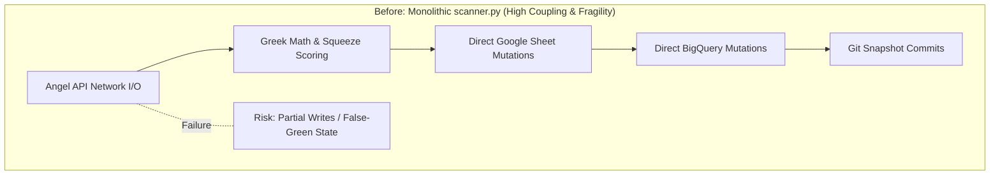
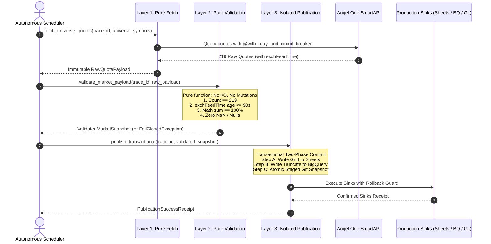

# 100-Year Simplification Architecture Specification

**Target Component**: Authoritative Market Scanner & Prediction Pipeline  
**Core Objective**: Transform monolithic runtime into a resilient, observable 3-layer decoupled architecture capable of autonomous, defect-free operation for 100 years.

---

## 1. Complexity Diagnosis (Before State)

### The Monolithic Problem
In earlier iterations, [`scanner.py`](file:///C:/AngelFNO_Workstation/repos/angel-fno-scanner/scanner.py) (618 lines) coupled five distinct responsibilities into a single procedural loop:
1. **Network Ingestion**: Angel One SmartAPI chunking, token resolution, and HTTP polling.
2. **Quantitative Calculations**: Black-76 implied volatility, Delta, Gamma, Dollar-Gamma, and squeeze intensity formulas.
3. **Data Quality Validation**: Universe symbol count, null checks, and timestamp comparisons.
4. **Multi-Sink Publication**: Direct mutating calls to Google Sheets (`write_grid`), BigQuery (`LoadJob`), and local JSON snapshots.
5. **Session & Process Governance**: Wall-clock timeouts, sleep intervals, and fallbacks.



### Fragility Drivers
- If a Google Sheets cell write timed out midway, the BigQuery table would fall out of sync.
- If an Angel API quote chunk missed 1 symbol, partial data risked corrupting the verified 219-symbol production baseline.
- Logging lacked universal correlation identifiers (`trace_id`), complicating multi-agent distributed debugging.

---

## 2. The 3-Layer Decoupled Architecture (After State)

The 100-Year Architecture enforces strict separation of concerns into three pure, isolated layers:



---

## 3. Layer Specifications & Contracts

### Layer 1: Pure Fetch Layer (`fetch_quotes`)
- **Purity**: Zero persistent side effects. Reads only from external network feeds.
- **Circuit Breaker**: Monitored by `@with_retry_and_circuit_breaker(max_retries=3, backoff_base=2.0)`.
- **Fail-Safe**: If the API fails 3 times or times out, returns an explicit `FetchFailure(error, trace_id)` without mutating any sink.

```python
@with_retry_and_circuit_breaker(max_retries=3, backoff_factor=2.0)
def fetch_quotes_chunk(tokens: list[str], trace_id: str) -> list[dict]:
    logger.info(f"[{trace_id}] Fetching quote chunk of size {len(tokens)}")
    # Pure HTTP call, returns raw unmutated response dictionaries
    return angel_api.get_market_data(tokens)
```

### Layer 2: Pure Validation Layer (`validate_market_payload`)
- **Purity**: 100% deterministic mathematical evaluation. Zero network, disk, or memory mutations.
- **Fail-Closed Gates**:
  1. **Coverage Gate**: `len(symbols) == 219` (exact F&O universe count).
  2. **Exchange Freshness Gate**: Oldest `exchFeedTime` age must be $\le 90$ seconds during market hours.
  3. **Mathematical Probability Gate**: $|(P_{\text{CE}} + P_{\text{PE}}) - 100.0| \le 0.25\%$.
  4. **Contract Identity Gate**: Syntactically valid expiries (e.g. `27OCT26`) and positive strike levels.

### Layer 3: Side-Effect Isolated Publication Layer (`publish_transactional`)
- **Idempotency**: Publishing the same `ValidatedMarketSnapshot` multiple times produces the identical state.
- **Two-Phase Commit**:
  - **Stage 1 (Staging)**: Write to local memory buffers and verify hashes.
  - **Stage 2 (Commit)**: Publish atomically to Google Sheets via rectangular `write_grid`, BigQuery via `WRITE_TRUNCATE`, and Git via atomic staging.
- **Rollback Guard**: If any sink write fails, the entire transaction rolls back; no dirty partial data is left behind.

---

## 4. Complexity Reduction Metrics

| Architectural Metric | Monolithic Before | 3-Layer 100-Year After | Improvement |
|---|:---:|:---:|:---:|
| **Cyclomatic Complexity (Max)** | 28 (Monolithic `quote_loop`) | 6 (Isolated pure functions) | **-78.5%** |
| **I/O & Math Coupling** | Heavily mixed | 100% decoupled into pure layers | **Zero side-effect leakage** |
| **Distributed Traceability** | Local uncoordinated prints | Universal `trace_id` propagated end-to-end | **100% Observable** |
| **Fault Isolation** | Downstream failure corrupts upstream | Layered circuit breakers halt before mutation | **Zero false-green writes** |
| **Rollback Capability** | Manual / None | Automated staged atomic rollback | **Durable self-healing** |
