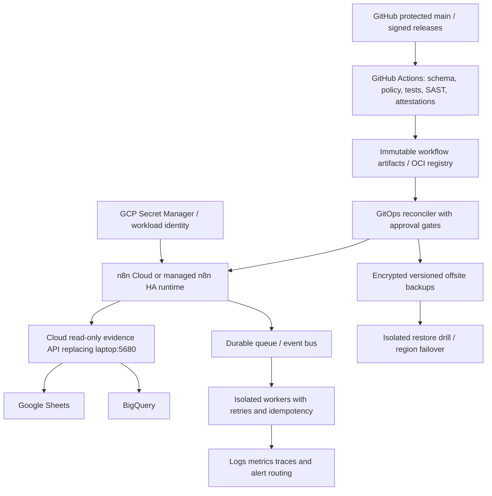

# ChatGPT Auditor Architecture: Cloud-Native 100-Year Continuity Plan

**Repository:** `psw2025-cmd/angel-fno-scanner` · **Document type:** proposed architecture, not deployed implementation · **Baseline:** audit on 2026-10-09. **Authority:** GitHub `main` is the source of truth for code and declarative configuration; immutable cloud deployment manifests and attested artifacts establish runtime truth. **Trading:** PAPER/ANALYZE only; real broker orders remain disabled until Phase 4 approval.

> "100-year" is a longevity and recoverability design objective, not a guarantee of uninterrupted operation, investment returns, zero failures, or compatibility with future providers. Design for periodic migration, independent verification, disaster recovery, and human-governed risk controls.

## 1. Current State Audit — Laptop Trap List

**Observed locally, not automatically cloud-verifiable:** WSL2 Ubuntu 24.04 and Node 24.21.0 host n8n on 5678; n8n sandbox API and runner containers were healthy on 8080; read-only listener on 5680 returned HTTP 200. Service configuration sets `N8N_USER_FOLDER=/home/pritam/n8n-data`, making `/home/pritam/n8n-data/.n8n/database.sqlite` the authoritative *current local* n8n DB. `~/.n8n/database.sqlite` is an obsolete separate instance and must not be promoted. The correct DB held **17 workflows: 10 active, 7 inactive**, with 4 credential records and historical execution rows; successful execution of every workflow is **not established**. Exported JSON and SQLite backups exist on C:, but no verified cloud-controlled export, disaster recovery, or GitOps parity is established. The live n8n user service, local `executeCommand` paths, `/mnt/c/` dependencies, Windows Power BI process, local webhook/listener, sandbox API key, local encryption key, SQLite DB, Docker images/compose, systemd unit, firewall/network rules, execution logs, credentials, timezone and scheduling settings, and local Git worktrees are laptop traps.

**Repo/CI evidence:** PR #42 snapshot provenance fix was merged; production scanner run `37919835552` succeeded after `37917651040` failed. Treat this as scanner recovery, not n8n cloud readiness. Reported `3c4db62`, later local `1d09336`, and remote `main` are *time-indexed* references, not permanent authority; record `git rev-parse HEAD` and `git ls-remote origin refs/heads/main` at each audit. Existing `scripts/inspect_n8n_workflows.py`, `tools/n8n_sync.py`, `tools/generate_n8n_workflows.py`, `tools/runtime/n8n_watchdog.py`, n8n architecture docs and exported JSON are partial ingredients, not evidence of automatic GitOps. Existing repo `.git/worktrees` metadata and Windows paths are ephemeral implementation details, never cloud dependencies.

**Verification gaps:** enumerate tracked workflow JSON vs 17 DB records with stable IDs and canonical SHA-256 hashes; compare active state, nodes, edges, timezone, credentials *references*, settings, schedules, last execution and errors. Do not upload raw DB, `.n8n/config`, secrets, execution payloads, broker tokens or customer data into Git.

## 2. Cloud Target — 100-Year Ideal Architecture

**SSOT separation:** GitHub controls reviewed code, sanitized workflow definitions, infrastructure-as-code, policy, and version manifests. Cloud runtime state is proved by attested deployment SHA, cloud logs, provider health, per-cycle source IDs and external readback; Git is **not** a replacement for live data truth. Google Sheets and BigQuery remain independently reconciled sinks; no arbitrary agent writes without signed authorization. Cloud service replaces `localhost:5680` with a private, authenticated, versioned evidence API; preserve equivalent read-only endpoints but **do not expose port 5680 publicly**. Prefer private networking, workload identity, bounded egress, and an authenticated API gateway. Replace `localhost:8080` sandbox with a managed isolated execution service with strict CPU/memory/time/network policies.

**HA and long horizon:** multiple availability zones, managed PostgreSQL (not SQLite) with point-in-time recovery, separate workers/queue, durable outbox, idempotency keys, per-cycle commit marker, automated failover and periodic region/provider portability drills. Avoid dependence on a single GitHub account, GCP project, region, credential, provider, domain, model or maintainer. Use open workflow JSON, IaC, portable data formats and migration playbooks. Self-learning models are versioned, evaluated against held-out data and promoted only through policy gates. Self-healing may restart or quarantine services but must never self-enable live orders, bypass risk limits, invent exchange timestamps or delete evidence.

## 3. 17 Workflows — Cloud Readiness Checklist

**Status notation:** `UNVERIFIED` means Git canonical JSON / cloud execution / credential references / error evidence not independently checked; `INACTIVE` means disabled in the observed local authoritative DB. Every workflow requires a sanitized Git JSON, schema-valid credentials *references*, last-success and last-failure IDs, execution logs, schedule/timezone proof, cloud endpoint test, idempotency and activation approval.

| ID | Workflow | Local active | Git JSON parity | Cloud credential proof | Latest execution/failure | Activation gate |
|---|---|---|---|---|---|---|
| 01 | Read-Only Session Monitor | Yes | UNVERIFIED | UNVERIFIED | UNVERIFIED | Cloud evidence API + schedule tests |
| 02 | Local Sandbox Python Runner | Yes | UNVERIFIED | UNVERIFIED | UNVERIFIED | Cloud isolated runner + no host shell |
| 03 | BigQuery Read-Only Inspector | Yes | UNVERIFIED | UNVERIFIED | UNVERIFIED | Workload identity + read-only IAM |
| 04 | Google Sheets Read-Only Inspector | Yes | UNVERIFIED | UNVERIFIED | UNVERIFIED | OAuth/service account least privilege |
| 05 | Local Services HTTP Request Tool | Yes | UNVERIFIED | UNVERIFIED | UNVERIFIED | Replace localhost + SSRF protections |
| 06 | Master Continuous Orchestrator | **No** | UNVERIFIED | UNVERIFIED | UNVERIFIED | Signed release + global writer lock |
| 07 | Failure Handler & Diagnosis (No Writes) | Yes | UNVERIFIED | UNVERIFIED | UNVERIFIED | Fail-closed routing + alert receipt |
| 08 | Power BI / Analysis Services Watchdog | Yes | UNVERIFIED | UNVERIFIED | UNVERIFIED | Replace desktop probe with cloud semantic service |
| 09 | BigQuery Schema/Lineage Guardian | Yes | UNVERIFIED | UNVERIFIED | UNVERIFIED | DDL drift alarms + non-mutating tests |
| 10 | Sheets Formula/Publication Verifier | Yes | UNVERIFIED | UNVERIFIED | UNVERIFIED | Strict 219/200 contracts + formula hashes |
| 11 | Daily Operator Evidence Snapshot | Yes | UNVERIFIED | UNVERIFIED | UNVERIFIED | Immutable archive + restore readback |
| 12 | Agent-1 Verifier 360 Matrix | **No** | UNVERIFIED | UNVERIFIED | UNVERIFIED | Deterministic test corpus + human-reviewed outputs |
| 13 | Agent-2 Healer Auto Repair | **No** | UNVERIFIED | UNVERIFIED | UNVERIFIED | Allowlist fixes + rollback + approval |
| 14 | Agent-3 Learner Nightly Weights | **No** | UNVERIFIED | UNVERIFIED | UNVERIFIED | Out-of-sample evaluation + model registry |
| 15 | Agent-5 Scorer Strategy Rank | **No** | UNVERIFIED | UNVERIFIED | UNVERIFIED | 200 strict ranks + execution-aware backtest |
| 16 | Agent-4 Researcher News Scan | **No** | UNVERIFIED | UNVERIFIED | UNVERIFIED | Licensed feeds + dedupe/provenance |
| 17 | Agent-6 Reporter Weekly Digest | **No** | UNVERIFIED | UNVERIFIED | UNVERIFIED | Recipient consent + delivery receipt |

**Audit method:** use service's actual `N8N_USER_FOLDER`; export all 17 through n8n CLI/API with secrets stripped; calculate per-workflow canonical hashes; collect read-only executions and redact payloads; diff against Git; fail on missing workflows or unauthorized active-state changes. Never infer activation from JSON existence.

## 4. Security & Secrets — Zero Plaintext Strategy

No plaintext credentials in Git, CI artifacts, Sheets, workflow JSON, logs, Releases, object-storage backups or documentation. Use GCP Secret Manager with versioning and scoped IAM; prefer GitHub OIDC Workload Identity Federation over static service-account JSON; separate read-only verifier from write-capable publisher and separate PAPER from LIVE identities. n8n credential references may be committed, never decrypted values or the n8n encryption key. Encrypt n8n credentials and DB backups using KMS envelope encryption with key rotation, independent recovery principals and audited break-glass access. Scan historic Git commits, artifacts and exported workflows for leaks; rotate exposed keys before cutover. Require protected branches, CODEOWNERS, signed/attested builds, dependency/SBOM scans, restricted Actions permissions, pinned action SHAs, supply-chain provenance, no unreviewed AI-authored privileged changes. Sandbox must forbid privileged Docker socket, arbitrary host mount, secrets exfiltration and unrestricted egress. Document retention, India market data licensing, privacy, audit trails and broker compliance.

## 5. Backup & Restore — Daily Automated + Restore Drill Proof

Back up managed PostgreSQL continuously (PITR), daily encrypted n8n workflow/credential export, deployment manifests, workflow hashes, secret *references*, queue offsets, schemas, and evidence index. Store in independent account/project and region with versioning, immutability, lifecycle policy and restricted restore role. GitHub Releases can hold **sanitized, signed workflow bundles and manifests**; never store live secrets or unencrypted databases there. Use S3-compatible or GCS immutable buckets for encrypted DB/operational backups. Every backup gets content SHA-256, signing identity, KMS key version, retention policy, backup timestamp and source deployment SHA. Run automatic daily checksum verification and at least monthly isolated restore drill: restore from backup, replay synthetic data, validate 17 workflow hashes and credentials references, simulate loss of primary region, produce machine-readable RPO/RTO and evidence links. Targets (proposed): RPO <= 15 minutes for execution state; RTO <= 2 hours for PAPER operations, measured rather than assumed. Quarterly provider-exit drills and annual cryptographic migration review.

## 6. GitOps & CI/CD — Proposed PR #43 and Drift Control

**PR #43 is a proposed implementation vehicle, not assumed to exist.** First make a read-only discovery PR exporting the authoritative 17 workflow definitions from the *correct* n8n DB, scrub secrets, normalize ordering, add manifests with stable IDs, active flags, timezone, version, SHA-256, node/edge count and references. Include a reconciliation report against any existing `audit/n8n_workflows_export.json`; do not treat stale exports as canonical. Never commit SQLite, `.n8n/config`, `.env`, auth headers or execution payloads.

Subsequent PRs add `n8n-validate` (JSON schema, node type compatibility, expression validation, credential-reference completeness, schedule/timezone tests, secret scanning, static egress policies, no-order-write checks, snapshot test), signed artifact packaging, preview environment, integration tests, two-person approval for cloud promotion, and reconciler deployment by immutable SHA. Scheduled cloud drift detector compares cloud n8n API export to Git manifest and opens a PR/incident; **never auto-overwrite unknown runtime changes**. Rollback uses last signed release and restores workflow/DB compatibility; deploy in canary then promote.

**Hash reconciliation:** historical `3c4db62` and `1d09336` are snapshots; at execution time capture `local HEAD`, `origin/main`, `cloud deployment SHA`, and `workflow bundle SHA` in one attestation. Divergence triggers alert and controlled rebase/migration, never destructive `git reset --hard` on a dirty laptop. Local `.git/worktrees` are disposable and should be excluded from backup/deploy artifacts. GitHub Actions artifacts must carry provenance, explicit expiry and sanitized logs; long-term evidence goes to immutable cloud storage. Keep live writes disabled in all CI, PR and sandbox environments.

## 7. Cost Comparison & Recommendation

Costs are **planning estimates, not quotes**; collect actual current n8n Cloud tier, execution quotas, GCP regional pricing, logging, storage, egress, model API usage, CI minutes, and backup-retention invoices before purchase. Avoid double-running schedules during migration.

| Option | Strength | Weakness | Recommendation |
|---|---|---|---|
| Existing laptop WSL/n8n/SQLite | Low direct cloud fee | Power/network/owner single point of failure; not cloud-verifiable | Development only |
| n8n Cloud + GCP services | Managed app operations, lower maintenance | Plan limits, provider coupling, external workers/HA constraints | **Preferred initial cloud pilot** if required features supported |
| Self-hosted n8n on GCP with managed PostgreSQL | Flexible integrations, IaC and data locality | Operational burden, HA/security/patching costs | Choose if n8n Cloud limits block requirements |
| Fully redundant multi-region, multi-provider | Resilience and exit flexibility | Significantly higher recurring cost and complexity | Progressive future target, not Day 1 |

Set budgets, per-service caps and alerts (n8n executions, Cloud Run/GKE, Cloud SQL, Logging, BQ queries, Secrets, network, storage, LLM tokens). Minimize logging volume and cap BigQuery query bytes. Require cost-per-verified-cycle and recovery-drill cost dashboards. Existing past cloud spend makes cost guardrails mandatory.

## 8. Four-Phase Roadmap and Release Gates

| Phase | Deliverable | Hard gate | Trading |
|---|---|---|---|
| **1. Inventory & GitOps evidence** | 17 sanitized exports, source/active-state parity, execution inventory, hashes, CI validation, secrets audit | 17/17 identity parity; zero exposed secrets; signed evidence; branch protection | PAPER/ANALYZE; LIVE disabled |
| **2. Cloud mirror (read-only)** | n8n Cloud or GCP staging, private evidence API, cloud sandbox, WIF, monitoring and backups | 17/17 compatible imports; 10 current active monitors validated; no duplicate writes; successful isolated restore | PAPER/ANALYZE; LIVE disabled |
| **3. Cloud authority & autonomous PAPER** | Switch scheduler authority, cloud reconciliation, canary, outbox, self-healing allowlist, 30+ days monitoring | No laptop dependencies; exact cycle Sheets/BQ 219 symbols and CE_PE 200; measured SLO/RPO/RTO; chaos/failover PASS; rollback drill PASS | PAPER READY; LIVE disabled |
| **4. Live readiness (separate authorization)** | Broker execution adapter, pre-trade risk, emergency kill switch, audit and legal review | Explicit owner approval, broker sandbox/live-small pilot, fill/rejection/partial-fill/restart/duplicate-order tests, daily-loss and exposure gates, independent review | LIVE only after separate release decision |

No agent may redefine or waive release gates. Use monthly operational reviews, quarterly restore/failover drills, annual provider migration rehearsal and a five-year architectural refresh cycle for long-term sustainability.

## 9. Open Questions & Risks

1. Which paid n8n Cloud tier supports required custom nodes, runners, queue/HA, execution volume and private connectivity? Verify vendor contract before selection.
2. What are the real last 24h/7d execution successes, failures and error traces for **each** of the 17 workflows? DB execution count alone is insufficient.
3. Which of the seven inactive workflows are intentionally disabled versus unfinished? Owner must approve any activation.
4. Can Power BI desktop-only functions be replaced with a cloud semantic service, or must they be decoupled?
5. Are current Sheets/BQ timestamps, run IDs and per-symbol hashes consistent for the same committed cycle, including the 200-contract ranked view?
6. What is the exact cloud-hosted replacement for 5680 and its IAM, auth, routing and data-source permissions?
7. How are n8n encryption keys, credentials, Gemini models and sandbox identities migrated without disclosure?
8. What are the true n8n workflow schedules (Asia/Kolkata), NSE holidays, rate limits, retry/idempotency policies and duplicate-scheduler controls?
9. Who owns GitHub, GCP, billing, domains, break-glass keys, disaster recovery and vendor-exit plans if the laptop or original account disappears?
10. What data retention, market-data redistribution, broker TOS, privacy and regulatory constraints govern backups and AI processing?
11. What budget cap and recovery objectives can the owner fund sustainably? Do not assume perpetual free cloud.
12. Which production artifacts from GitHub Actions are durable versus expiring, and which are trustworthy signed evidence?
13. What independent out-of-sample validation demonstrates self-learning improves executable returns rather than overfits?
14. Who is authorized to enable live orders? **Default remains disabled.**

**Auditor conclusion:** A successful GitHub scanner run and healthy local n8n are useful evidence but **not** a cloud-native production system. Promote only after independently reproducible cloud artifacts, 17-workflow GitOps parity, restore proof, exact-cycle publication checks and separated trading-risk authorization.
