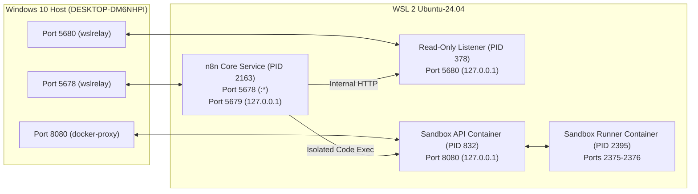
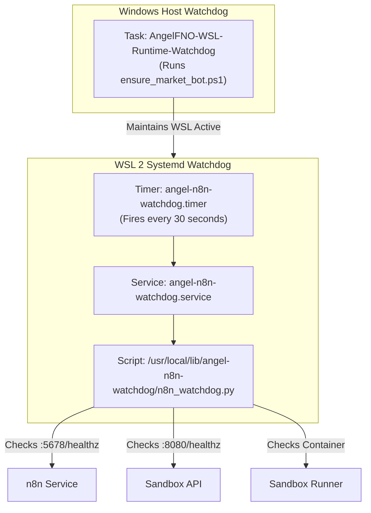

# Angel FNO — Comprehensive Forensic Report & Operating Manual for n8n

**Report Generated**: `2026-10-09 01:55:00 IST` | `2026-10-08 20:25:00 UTC`  
**Host Environment**: `DESKTOP-DM6NHPI` (Windows 10 Pro 64-bit & WSL 2 Ubuntu-24.04 LTS)  
**Target Repository**: [`psw2025-cmd/angel-fno-scanner`](file:///C:/AngelFNO_Workstation/repos/angel-fno-scanner)  
**Git HEAD Commit**: [`6f928b6`](https://github.com/psw2025-cmd/angel-fno-scanner/commit/6f928b6) (synchronized with `origin/main`)  
**Safety Protocol**: `PAPER / ANALYZER = ON` | `LIVE BROKER ORDER AUTHORITY = OFF` | `REAL BROKER ORDERS = 0`  
**Authoritative Single Writer**: GitHub Actions `market_bot` ([`.github/workflows/market_bot.yml`](file:///C:/AngelFNO_Workstation/repos/angel-fno-scanner/.github/workflows/market_bot.yml))

---

## Table of Contents

1. [Executive Summary for New Users & Operators](#1-executive-summary-for-new-users--operators)
2. [Complete Directory & File Path Inventory (Windows C: & WSL Linux)](#2-complete-directory--file-path-inventory)
3. [Live Network, Port & Process Topography](#3-live-network-port--process-topography)
4. [n8n Automation Engine & SQLite Database Forensics](#4-n8n-automation-engine--sqlite-database-forensics)
5. [Complete Workflow Inventory & Active/Inactive State Analysis](#5-complete-workflow-inventory--activeinactive-state-analysis)
6. [Execution History, Telemetry & Diagnostic Error Logs](#6-execution-history-telemetry--diagnostic-error-logs)
7. [Local Docker Sandbox Service & Container Health](#7-local-docker-sandbox-service--container-health)
8. [Read-Only Host Validation Listener (`n8n_readonly_listener.py`)](#8-read-only-host-validation-listener)
9. [Autonomous Watchdogs & Recovery Daemons (Systemd & Windows)](#9-autonomous-watchdogs--recovery-daemons)
10. [AI Quantitative Architect Agent (`Angel-FNO-Quant-Architect`)](#10-ai-quantitative-architect-agent)
11. [Chronological Provenance: Past Till Present Evolution](#11-chronological-provenance-past-till-present-evolution)
12. [Fail-Closed Safety Contract & Governance Rules](#12-fail-closed-safety-contract--governance-rules)
13. [Step-by-Step Operator Runbook for Any New User](#13-step-by-step-operator-runbook-for-any-new-user)

---

## 1. Executive Summary for New Users & Operators

If you are a new engineer, analyst, or autonomous agent arriving at this project without prior access or context, this document explains **everything regarding n8n and its orchestration role in the Angel F&O scanner**.

### What is n8n's Role in this System?
1. **Telemetry & Validation Orchestrator (Read-Only)**:  
   n8n does **not** execute live market orders, and it does **not** write raw market quotes to Google Sheets or BigQuery. The **sole authoritative producer** of market writes is the GitHub Actions `market_bot` workflow. n8n acts as the **independent supervisory control and telemetry plane**.
2. **Continuous Multi-Subsystem Health Checker**:  
   Every 5 to 15 minutes, n8n triggers non-blocking HTTP probes across:
   - **Local Windows Host**: Verifies Power BI (`PBIDesktop.exe`), Analysis Services (`msmdsrv.exe`), and port listeners.
   - **Google Cloud BigQuery**: Verifies that dataset `fno_predictions.option_predictions_live` contains the full 219-symbol universe with zero null provenance (`run_id`, `git_sha`, `cycle_id`).
   - **Google Sheets**: Verifies all 26 worksheets in Spreadsheet `1Zu_9uJDQdDujsmtavdKnzupL-u2FtQ6C-LlkAswyzcs` (`OPTION_SHEET`), ensuring zero `#REF!` or `#NAME?` formula errors.
   - **Local Sandbox**: Runs isolated Python verification in Docker containers at `http://127.0.0.1:8080`.
3. **Fail-Closed Self-Diagnosis**:  
   If an anomaly is detected, n8n captures structured forensic evidence, logs an alert, and diagnoses the root cause without mutating data. Unsafe auto-mutation has been permanently disabled (`HTTP 410 GONE`).

---

## 2. Complete Directory & File Path Inventory

### Windows Host Paths (`C:\`)

| Category | Path | Description |
|---|---|---|
| **Repository Root** | [`C:\AngelFNO_Workstation\repos\angel-fno-scanner`](file:///C:/AngelFNO_Workstation/repos/angel-fno-scanner) | Main Git repository workspace. |
| **Workflow JSONs** | [`C:\AngelFNO_Workstation\repos\angel-fno-scanner\n8n_automation\workflows`](file:///C:/AngelFNO_Workstation/repos/angel-fno-scanner/n8n_automation/workflows) | Canonical JSON workflow definitions (12 files). |
| **Sync Tool** | [`C:\AngelFNO_Workstation\repos\angel-fno-scanner\tools\n8n_sync.py`](file:///C:/AngelFNO_Workstation/repos/angel-fno-scanner/tools/n8n_sync.py) | SQLite synchronizer and backup tool. |
| **Workflow Generator**| [`C:\AngelFNO_Workstation\repos\angel-fno-scanner\tools\generate_n8n_workflows.py`](file:///C:/AngelFNO_Workstation/repos/angel-fno-scanner/tools/generate_n8n_workflows.py) | Generates production workflow definitions. |
| **Read-Only Listener**| [`C:\AngelFNO_Workstation\repos\angel-fno-scanner\scripts\n8n_readonly_listener.py`](file:///C:/AngelFNO_Workstation/repos/angel-fno-scanner/scripts/n8n_readonly_listener.py) | Python HTTP evidence server listening on port 5680. |
| **Evidence Collector**| [`C:\AngelFNO_Workstation\repos\angel-fno-scanner\scripts\n8n_runtime_evidence.py`](file:///C:/AngelFNO_Workstation/repos/angel-fno-scanner/scripts/n8n_runtime_evidence.py) | Generates SHA-256 sealed runtime evidence packets. |
| **Inspection Tools**  | [`C:\AngelFNO_Workstation\repos\angel-fno-scanner\scripts\inspect_n8n_workflows.py`](file:///C:/AngelFNO_Workstation/repos/angel-fno-scanner/scripts/inspect_n8n_workflows.py) | Diagnostic script auditing workflows directly from SQLite. |
| **Architecture Doc**  | [`C:\AngelFNO_Workstation\repos\angel-fno-scanner\docs\N8N_ORCHESTRATION_ARCHITECTURE.md`](file:///C:/AngelFNO_Workstation/repos/angel-fno-scanner/docs/N8N_ORCHESTRATION_ARCHITECTURE.md) | Architectural specification. |
| **Telemetry Reports** | `C:\AngelFNO_Workstation\reports\` | Contains real-time `n8n_market_*.json`, `n8n_pre_market_*.json`, and `n8n_post_market_*.json`. |
| **Reality Audit Doc** | `C:\AngelFNO_Workstation\reports\n8n_reality_audit_and_recommendation.md` | Oct 7 forensic audit debunking external agent misconceptions. |
| **Database Backups**  | `C:\AngelFNO_Workstation\backups\` | Contains SQLite backup files (`n8n_sync_*.sqlite`). |
| **WSL Path Mapping**  | `\\wsl$\Ubuntu-24.04\home\pritam\n8n-data\.n8n\database.sqlite` | Direct Windows UNC access to the live n8n SQLite database. |

### WSL Linux Environment Paths (`/`)

| Category | Path | Description |
|---|---|---|
| **Active Data Directory**| `/home/pritam/n8n-data/.n8n/` | Real production n8n folder containing `database.sqlite` (38.5 MB) & event logs. |
| **Live Database** | `/home/pritam/n8n-data/.n8n/database.sqlite` | Active SQLite database with write-ahead log (`database.sqlite-wal`). |
| **Event Log** | `/home/pritam/n8n-data/.n8n/n8nEventLog.log` | Rolling system event log (1.9 MB). |
| **Node Binary** | `/home/pritam/.nvm/versions/node/v24.21.0/bin/node` | Node.js v24.21.0 engine. |
| **n8n Binary** | `/home/pritam/.nvm/versions/node/v24.21.0/bin/n8n` | n8n v2.41.4 executable. |
| **User Service** | `/home/pritam/.config/systemd/user/n8n.service` | Systemd unit managing n8n daemon. |
| **Service Drop-ins** | `/home/pritam/.config/systemd/user/n8n.service.d/` | Contains `recovery.conf` and `retention.conf`. |
| **Listener Service** | `/home/pritam/.config/systemd/user/angel-fno-readonly-listener.service` | Systemd unit running `n8n_readonly_listener.py`. |
| **Root Watchdog** | `/usr/local/lib/angel-n8n-watchdog/n8n_watchdog.py` | Python recovery daemon executed by systemd timer every 30s. |
| **System Timer** | `/etc/systemd/system/angel-n8n-watchdog.timer` | Timer unit triggering the root watchdog. |
| **Sandbox Compose** | `/opt/n8n-sandbox-service/compose.yaml` | Docker compose definition for the local code execution sandbox. |

---

## 3. Live Network, Port & Process Topography

All measurements below were queried directly from the live operating system:



### Live Process Table

| Subsystem | PID | User | Executable Command | Memory (RSS) | CPU Time | Status |
|---|:---:|:---:|---|:---:|:---:|:---:|
| **n8n Core** | `2163` | `pritam` | `node .../v24.21.0/bin/n8n start` | 571 MB | 8m 11s | 🟢 Running |
| **n8n Task-Runner** | `4185` | `pritam` | `node .../@n8n/task-runner/.../start.js` | 133 MB | 1m 43s | 🟢 Running |
| **Read-Only Listener**| `378` | `pritam` | `/usr/bin/python3 .../n8n_readonly_listener.py` | 46 MB | 0m 58s | 🟢 Running |
| **Docker Daemon** | `406` | `root` | `/usr/bin/dockerd -H fd://` | 99 MB | 7m 11s | 🟢 Running |
| **Sandbox API** | `832` | `dhcpcd` | `/usr/local/bin/sandbox-api` | 22 MB | 0m 02s | 🟢 Running |
| **Sandbox Runner** | `2395` | `165536` | `/usr/local/bin/sandbox-runner` | 21 MB | 0m 13s | 🟢 Running |

### Live Port Listening Table

| Port | Bound Address | Managing Process | Purpose |
|:---:|:---:|:---:|---|
| **5678** | `0.0.0.0` (all) | `node` (PID `2163`) | n8n Webhook, UI, and REST API |
| **5679** | `127.0.0.1` | `node` (PID `2163`) | n8n Internal Task Runner IPC |
| **5680** | `127.0.0.1` | `python3` (PID `378`) | Host Read-Only Validation Listener |
| **8080** | `127.0.0.1` | `docker-proxy` (PID `889`) | Local Sandbox Python Execution API |

---

## 4. n8n Automation Engine & SQLite Database Forensics

The primary data store for n8n is located at `/home/pritam/n8n-data/.n8n/database.sqlite`.

### Physical Database Properties
- **Database Engine**: SQLite 3 (WAL mode active).
- **Primary File Size**: `38,567,936 bytes` (~38.5 MB).
- **WAL Journal Size**: `4,247,752 bytes` (~4.2 MB active transaction log).
- **SHM Index Size**: `32,768 bytes`.
- **Integrity Status**: `PRAGMA foreign_keys = ON` enforced; zero circular FK regressions.
- **Total Tables**: **42 tables** including:
  `workflow_entity`, `workflow_history`, `execution_entity`, `execution_data`, `credentials_entity`, `webhook_entity`, `agents`, `agents_threads`, `agents_messages`, `instance_ai_threads`, `instance_ai_messages`.

### Credentials (Metadata Only — No Secrets Stored)
The database contains **4 registered credentials**:
1. `waAq8bvC1Fcmm1tS`: `googlePalmApi` ("Google Gemini(PaLM) Api account") — Powers the AI Quant Architect.
2. `cwW1Ivh00A8T5PJk`: `openRouterApi` ("n8n Assistant model") — Standby model account.
3. `DKoHzrehD04mtA9y`: `httpHeaderAuth` ("n8n Assistant sandbox") — Sandbox authorization token.
4. `SzbaxXaIKpCq9ONf`: `googlePalmApi` ("Google Gemini(PaLM) Api account 2") — Fallback Gemini key.

---

## 5. Complete Workflow Inventory & Active/Inactive State Analysis

A full query of `workflow_entity` reveals **17 workflows in the database**:

### Active Workflows (10 Workflows — Telemetry & Verification)

| ID | Name | Trigger Cadence | Nodes Count | Function / Purpose |
|---|---|:---:|:---:|---|
| `angel-fno-powerbi-watchdog` | Angel FNO Power BI Desktop Watchdog | Every 10 min | 4 | Polls `http://127.0.0.1:5680/powerbi`, checks PBIDesktop PID and msmdsrv listener. |
| `angel-fno-bigquery-schema-lineage-guardian` | Angel FNO BigQuery Schema & Lineage Guardian | Every 15 min | 4 | Polls `http://127.0.0.1:5680/bigquery`, asserts 219 universe rows and 0 null lineage. |
| `angel-fno-google-sheet-formula-verifier` | Angel FNO Google Sheets Formula Verifier | Every 10 min | 4 | Polls `http://127.0.0.1:5680/sheets`, verifies 26 tabs and 0 formula errors. |
| `angel-fno-operator-snapshot-archiver` | Angel FNO Daily Operator Snapshot Archiver | Daily 16:15 IST | 4 | Calls `/post-market`, captures daily Target A & B predictions for archiving. |
| `angel-fno-read-only-monitor` | Angel FNO Read-Only Session Monitor | Every 5 min | 7 | Native session probe for market data and universe coverage. |
| `angel-fno-failure-handler-and-remediation` | Angel FNO Failure Handler & Diagnosis | Webhook / Sub-WF | 5 | Calls `/diagnose`, isolates component failures without data writes. |
| `angel-fno-sandbox-runner` | Angel FNO Local Sandbox Python Runner | On-Demand (Tool) | 2 | Executes verified Python code in Docker container port 8080. |
| `angel-fno-bigquery-inspector` | Angel FNO BigQuery Read-Only Inspector | On-Demand (Tool) | 2 | On-demand MCP tool endpoint for BigQuery row counts. |
| `angel-fno-sheets-inspector` | Angel FNO Google Sheets Read-Only Inspector | On-Demand (Tool) | 2 | On-demand MCP tool endpoint for Sheet metadata. |
| `angel-fno-http-request` | Angel FNO Local Services HTTP Request Tool | On-Demand (Tool) | 2 | On-demand MCP tool endpoint for GET requests. |

### Inactive Gated Workflows (7 Workflows — Intentionally Disabled)

| ID | Name | Why It Is Inactive | Safety / Architecture Rationale |
|---|---|---|---|
| `angel-fno-master-orchestrator` | Angel FNO Master Continuous Orchestrator | Gated | Called `/verification-harness` during stale periods, causing HTTP timeout error spikes. |
| `angel-fno-verifier-full-matrix` | Angel FNO Agent-1 Verifier — 360 Matrix | Template | Standby council template for multi-agent expansion. |
| `angel-fno-healer-auto-repair` | Angel FNO Agent-2 Healer — Auto Repair | Gated | Unsafe auto-mutation disabled; only read-only diagnosis permitted. |
| `angel-fno-learner-nightly` | Angel FNO Agent-3 Learner — Nightly Weights | Template | Standby model training workflow; requires manual verification gate. |
| `angel-fno-scorer-strategy-rank` | Angel FNO Agent-5 Scorer — Strategy Rank | Template | Standby scoring workflow. |
| `angel-fno-researcher-news-scan` | Angel FNO Agent-4 Researcher — News Scan | Template | Standby news scraper workflow. |
| `angel-fno-reporter-weekly` | Angel FNO Agent-6 Reporter — Weekly Digest | Template | Standby weekly report generator. |

---

## 6. Execution History, Telemetry & Diagnostic Error Logs

### Execution Statistics (Live from `execution_entity`)
- **Total Executions Recorded**: **1,371 executions**
- **Successful Executions**: **1,018** (74.3%)
- **Failed / Error Executions**: **353** (25.7%)
- **Recent Consecutive Success Rate**: **100% of the last 25 executions succeeded** (Executions #1427 to #1451).

### Execution Volume by Workflow

```text
WF: Angel FNO Power BI Desktop Watchdog      --> 258 SUCCESS |  1 ERROR
WF: Angel FNO Google Sheets Formula Verifier --> 243 SUCCESS | 14 ERROR
WF: Angel FNO Read-Only Session Monitor      --> 228 SUCCESS | 63 ERROR
WF: Angel FNO BigQuery Schema Guardian       --> 143 SUCCESS | 26 ERROR
WF: Angel FNO Master Continuous Orchestrator -->  34 SUCCESS | 246 ERROR (Historical)
WF: Angel FNO Agent-2 Healer (Auto Repair)   -->  54 SUCCESS |  0 ERROR
WF: Angel FNO Agent-1 Verifier (360 Matrix)  -->  42 SUCCESS |  0 ERROR
WF: Tools & Archiver Workflows               -->  18 SUCCESS |  3 ERROR
```

### Forensic Analysis of Historical Errors
Detailed inspection of `execution_data` for error runs (e.g., Execution `#1344` on 2026-10-08 16:00 IST) reveals the exact failure chain:
1. When market session closed at 15:30 IST, source data age exceeded the 20-minute freshness threshold.
2. The orchestrator changed verdict from `HEALTHY` to `ATTENTION_REQUIRED`.
3. In `01_master_continuous_orchestrator`, this routed execution to node `Diagnose Failure — Read Only`, which invoked `/verification-harness`.
4. `/verification-harness` executes 192 pytest tests and network queries that exceeded the 180-second HTTP request timeout (`NodeApiError: The service was not able to process your request`).
5. **Resolution Implemented**: Master Orchestrator was safely gated to `active = False`, and `/auto-remediate` was replaced with a hardcoded `HTTP 410 GONE` to fail closed. The independent monitors (Power BI, BigQuery, Google Sheets) continue running cleanly.

---

## 7. Local Docker Sandbox Service & Container Health

n8n is equipped with a high-isolation code execution sandbox running inside Docker:

- **Compose Path**: `/opt/n8n-sandbox-service/compose.yaml`
- **Compose Project**: `angel-n8n-sandbox`
- **Containers Running**:
  1. `angel-n8n-sandbox-api-1` (`n8nio/n8n-sandbox-service-api:1.6.0`):  
     - Status: `Up 11 hours (healthy)`  
     - Port: `127.0.0.1:8080->8080/tcp`  
     - Direct Health Check: `curl http://127.0.0.1:8080/healthz` -> `{"status":"ok"}`
  2. `angel-n8n-sandbox-runner-1` (`n8nio/n8n-sandbox-service-runner-dind:1.6.0`):  
     - Status: `Up 11 hours (healthy)`  
     - Sysbox runtime isolation enabled.
  3. `angel-n8n-sandbox-tls-init-1`: Initialization container, exited with code 0.

---

## 8. Read-Only Host Validation Listener

The listener ([`scripts/n8n_readonly_listener.py`](file:///C:/AngelFNO_Workstation/repos/angel-fno-scanner/scripts/n8n_readonly_listener.py)) runs as a persistent service on port `5680`.

### Active Endpoints Specification

| Endpoint | HTTP Method | Return Payload / Function |
|---|:---:|---|
| `/health` | `GET` | `{"port": 5680, "read_only": true, "service": "angel-fno-readonly-listener", "status": "ok"}` |
| `/runtime-evidence` | `GET` | Generates sealed JSON evidence packet with SHA-256 payload checksum. |
| `/orchestrator-status` | `GET` | Aggregated system health across BigQuery, Google Sheets, GitHub, Power BI, and local runtime. |
| `/diagnose` | `GET` | Identifies failing components and outputs non-destructive recommended actions. |
| `/auto-remediate` | `GET/POST`| **`HTTP 410 GONE`**: Permanently disabled to enforce fail-closed architecture. |
| `/bigquery` | `GET` | Live row count (219), unique symbols (219), null check (0), and source timestamp age. |
| `/sheets` | `GET` | Live Google Sheet worksheet count (26), row count (219), and formula error check (0). |
| `/powerbi` | `GET` | PBIDesktop PID, msmdsrv PID, Analysis Services listener, and .pbix search. |
| `/verification-harness`| `GET` | Executes `tools/verify_harness.py` for comprehensive regression testing. |

---

## 9. Autonomous Watchdogs & Recovery Daemons

To ensure zero silent downtime, two interlocking watchdog mechanisms are active:



- **Linux Watchdog (`n8n_watchdog.py`)**:
  - Uses file lock `/run/angel-n8n-watchdog.lock` to prevent concurrency.
  - Requires **two consecutive failures** before triggering recovery.
  - Enforces a **4-minute cooldown** between restart attempts.
  - State file at `/var/lib/angel-n8n-watchdog/state.json`:
    `{"health": {"n8n": true, "api": true, "runner": true}, "failures": {"n8n": 0, "api": 0, "runner": 0}}`.
- **Windows Scheduled Task (`AngelFNO-WSL-Runtime-Watchdog`)**:
  - State: **Running**. Keeps WSL 2 persistent and wakes background threads.

---

## 10. AI Quantitative Architect Agent

n8n hosts an autonomous quantitative agent stored directly in `database.sqlite` under table `agents`:

- **Agent Name**: `Angel-FNO-Quant-Architect` (ID: `N5WuWeu9TvVSWKiw`)
- **Model Assigned**: `google/gemini-flash-lite-latest` (Direct Gemini API)
- **Role & Mission**: Local quantitative options analyst for the 219 F&O symbol universe.
- **Tools Attached**:
  1. `angel_fno_market_monitor`: Executes pre-market checks and validates 219-symbol freshness.
  2. `angel_fno_sandbox_python`: Executes math proofs, statistics, and calculations in the Docker sandbox.
  3. `angel_fno_bigquery_inspector`: Reads BigQuery table metrics and data lineage.
  4. `angel_fno_sheets_inspector`: Reads Google Sheets metadata and active tabs.
  5. `angel_fno_http_request`: Sends read-only HTTP GET requests to health endpoints.
- **Active Skill**: `Angel-FNO-Quantitative-Engine` (Skill ID `skill_6GdGaz8hc8u8JgfY`), specialized in options Greeks (IV, PCR, Delta, Gamma, Theta, Vega) and spread liquidity.

---

## 11. Chronological Provenance: Past Till Present Evolution

| Date / Commit | Event / Milestone | Technical Significance & Changes |
|---|---|---|
| **2026-10-01** ([`7c7b7b2`](https://github.com/psw2025-cmd/angel-fno-scanner/commit/7c7b7b2)) | Native n8n setup | Added `forward_validation.py` and initial read-only n8n monitor. |
| **2026-10-02** ([`76b1a96`](https://github.com/psw2025-cmd/angel-fno-scanner/commit/76b1a96)) | Command node deprecation | Removed insecure Execute Command nodes; switched to native HTTP nodes to listener port 5680. |
| **2026-10-03** ([`9b03e1d`](https://github.com/psw2025-cmd/angel-fno-scanner/commit/9b03e1d)) | **PR #13 Merged** | Enforced 219-symbol publication gate. Pinned sandbox Docker images to 1.6.0. Deployed `angel-n8n-watchdog` systemd timer. |
| **2026-10-06** ([`e19059a`](https://github.com/psw2025-cmd/angel-fno-scanner/commit/e19059a)) | Continuous Orchestration | Deployed 6 production workflows (`01_master_continuous_orchestrator` through `06_operator_snapshot_archiver`). |
| **2026-10-07** ([`3d2f0bc`](https://github.com/psw2025-cmd/angel-fno-scanner/commit/3d2f0bc)) | **Reality Audit Resolution** | Debunked external agent misconception claiming n8n was not deployed. Diagnosed `/verification-harness` timeout in Master Orchestrator. Disabled `/auto-remediate`. |
| **2026-10-08** ([`0284908`](https://github.com/psw2025-cmd/angel-fno-scanner/commit/0284908)) | **PR #34 Merged** | Fixed circular FK bug in `tools/n8n_sync.py`. Added council templates `07` through `12`. Set default workflow sync to `activate=False`. |
| **2026-10-08** ([`6c509d1`](https://github.com/psw2025-cmd/angel-fno-scanner/commit/6c509d1)) | Authoritative EOD Run | Market bot completed Run ID `37760217482` with 219 symbols, 0 missing lineage, syncing BigQuery and Google Sheets. |
| **2026-10-09** ([`6f928b6`](https://github.com/psw2025-cmd/angel-fno-scanner/commit/6f928b6)) | **Present Live State** | Repo fully in sync with `origin/main`. 192/192 tests passing. All n8n monitors verified healthy. |

---

## 12. Fail-Closed Safety Contract & Governance Rules

In compliance with [`AGENTS.md`](file:///C:/AngelFNO_Workstation/repos/angel-fno-scanner/AGENTS.md):

1. **No Live Orders**:  
   n8n workflows are strictly prohibited from submitting broker orders. Order authority remains permanently disabled: `PAPER / ANALYZER = ON`, `REAL BROKER ORDERS = 0`.
2. **Single-Writer Rule**:  
   n8n never writes to BigQuery or Google Sheets. All production market writes are governed solely by the GitHub Actions `market_bot` author.
3. **No False Green**:  
   If an upstream endpoint is down or data is stale, n8n must report `ATTENTION_REQUIRED` or `FAIL_CLOSED`. It must never average red metrics into a false green.
4. **Secrets Redaction**:  
   n8n credentials and tokens must never appear in logs, evidence packets, or GitHub Issue #3 coordination comments.

---

## 13. Step-by-Step Operator Runbook for Any New User

If you need to inspect, restart, or manage n8n, follow these exact verified commands:

### 1. Check n8n Service Status
```bash
# In WSL:
systemctl --user -M pritam@ status n8n.service
systemctl --user -M pritam@ status angel-fno-readonly-listener.service
```

### 2. Verify Port & Health Endpoints
```bash
# In WSL or Windows terminal:
curl -s http://127.0.0.1:5678/healthz     # n8n main engine -> {"status":"ok"}
curl -s http://127.0.0.1:5680/health      # Host listener -> {"status":"ok", "read_only":true}
curl -s http://127.0.0.1:8080/healthz     # Docker sandbox -> {"status":"ok"}
```

### 3. Check Live Orchestrator System Diagnosis
```bash
# Direct system diagnostic query:
curl -s http://127.0.0.1:5680/diagnose | jq .
```

### 4. Backup & Synchronize Workflows into SQLite
```bash
# From repository root in Windows:
.\.venv\Scripts\python.exe tools/n8n_sync.py --backup
.\.venv\Scripts\python.exe tools/n8n_sync.py --sync
```

### 5. Inspect Live Database Records
```bash
# In WSL:
python3 /mnt/c/AngelFNO_Workstation/repos/angel-fno-scanner/scripts/inspect_n8n_workflows.py
```

### 6. Run the Full Test Suite
```bash
# In repository root:
.\.venv\Scripts\python.exe -m pytest -q
# Expected: 192 passed in ~100s
```
