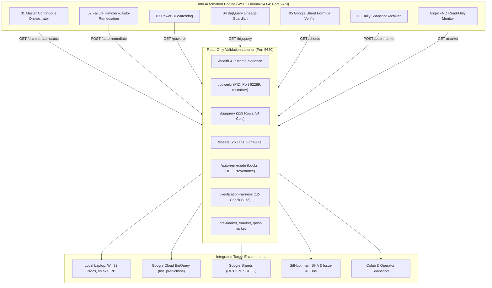

# Angel FNO n8n Multi-Agent Orchestration Architecture

> **Canonical Operating Specification for Continuous n8n Automation & Orchestration**
> Repository: `psw2025-cmd/angel-fno-scanner`
> Governing Protocol: [`AGENTS.md`](../AGENTS.md) | Safety: `PAPER / ANALYZER = ON`, `REAL BROKER ORDERS = 0`

---

## 1. Executive Summary & Core Mission

This document defines the unified, production-grade **n8n Multi-Agent Orchestration Architecture** for the Angel FNO Market Intelligence System. 

It interconnects and continuously monitors seven key subsystems:
1. **Local Windows Laptop**: Windows processes (`PBIDesktop.exe`, `msmdsrv.exe`), local ports, Everything fast file search (`es.exe`), and verification test harnesses.
2. **GitHub Ecosystem**: Branch synchronization, commit tracking, CI/CD workflow runs, and canonical cross-agent coordination on **GitHub Issue #3**.
3. **Google Cloud BigQuery**: Authoritative 54-column DDL schema, 219 partitioned & clustered universe rows, zero null provenance (`run_id`, `git_sha`, `cycle_id`), and auxiliary audit lineage.
4. **Google Sheets (`OPTION_SHEET`)**: 26 synchronized tabs (`HEARTBEAT`, `FORENSIC_LIVE`, `Formula Checks`, `WRITE_PROVENANCE`), validating live cell formulas and preventing stale ticks.
5. **Colab & Daytona Sandbox**: Automated execution isolation and snapshot archival into `operator/snapshots/YYYY-MM-DD/`.
6. **Power BI Desktop & Semantic Engine**: Real-time process watchdog, port 62289 Analysis Services listener, and report visual freshness.
7. **AI Orchestra & Autonomous Remediation**: Strict fail-closed failure handling, automatic lock clearing, schema alignment, and peer-verifiable evidence generation.

---

## 2. High-Level Orchestration Flow

---

## 3. The 6 Production Workflows in `n8n_automation/workflows/`

### Workflow 1: Master Continuous Orchestrator (`01_master_continuous_orchestrator.json`)
- **Workflow ID:** `angel-fno-master-orchestrator`
- **Cadence:** Every 5 minutes during market hours (`*/5 9-15 * * 1-5`), every 15 minutes off-peak.
- **Webhook Endpoint:** `GET /webhook/orchestrator-run`
- **Execution Flow:**
  1. Polls `http://127.0.0.1:5680/orchestrator-status`.
  2. Evaluates aggregate health across Power BI (`HEALTHY`), BigQuery (219 rows with provenance), and local runtime evidence.
  3. If **HEALTHY**: formats and logs green heartbeat telemetry.
  4. If **ATTENTION_REQUIRED**: routes to automatic remediation endpoint (`/auto-remediate`), followed by post-remediation verification (`/verification-harness`).

### Workflow 2: Failure Handler & Auto-Remediation (`02_failure_handler_and_auto_remediation.json`)
- **Workflow ID:** `angel-fno-failure-handler-and-remediation`
- **Trigger:** Webhook `POST /webhook/auto-remediate` or direct execution from other workflows.
- **Execution Flow:**
  1. Calls `http://127.0.0.1:5680/auto-remediate`.
  2. Clears stale `.control-center.lock` files (> 120s old).
  3. Verifies BigQuery 54-column DDL schema and ensures columns exist.
  4. Synchronizes cycle provenance to auxiliary tables via `scripts/sync_cycle_provenance_to_bq.py`.
  5. Automatically executes `tools/verify_harness.py` to confirm 12-check status.
  6. Emits `REMEDIATED_VERIFIED` or fail-closed alert.

### Workflow 3: Power BI Desktop & Analysis Services Watchdog (`03_powerbi_watchdog.json`)
- **Workflow ID:** `angel-fno-powerbi-watchdog`
- **Cadence:** Every 10 minutes (`*/10 * * * *`).
- **Webhook Endpoint:** `GET /webhook/powerbi-check`
- **Execution Flow:**
  1. Queries `http://127.0.0.1:5680/powerbi`.
  2. Inspects `PBIDesktop.exe` PID, responsiveness, and working set.
  3. Inspects `msmdsrv.exe` PID and active Analysis Services TCP listener (port 62289).
  4. Detects local `.pbix` models on disk.
  5. Emits `HEALTHY` or provides automated start command recommendations.

### Workflow 4: BigQuery Schema & Lineage Guardian (`04_bigquery_schema_lineage_guardian.json`)
- **Workflow ID:** `angel-fno-bigquery-schema-lineage-guardian`
- **Cadence:** Every 30 minutes (`*/30 * * * *`).
- **Webhook Endpoint:** `GET /webhook/bigquery-audit`
- **Execution Flow:**
  1. Calls `http://127.0.0.1:5680/bigquery`.
  2. Asserts total universe = 219 symbols in `fno_predictions.option_predictions_live`.
  3. Asserts 100% provenance completeness: `countif(run_id is not null) == 219`, `countif(git_sha is not null) == 219`.
  4. Emits `SCHEMA_AND_LINEAGE_PERFECT` or triggers Auto-Remediation if drift is detected.

### Workflow 5: Google Sheets Formula & Provenance Verifier (`05_google_sheet_formula_forensic_verifier.json`)
- **Workflow ID:** `angel-fno-google-sheet-formula-verifier`
- **Cadence:** Every 15 minutes (`*/15 * * * *`).
- **Webhook Endpoint:** `GET /webhook/sheets-verify`
- **Execution Flow:**
  1. Queries `http://127.0.0.1:5680/sheets`.
  2. Confirms all 26 worksheets exist in Spreadsheet `1Zu_9uJDQdDujsmtavdKnzupL-u2FtQ6C-LlkAswyzcs`.
  3. Confirms 219 rows in `FORENSIC_LIVE`.
  4. Checks formula integrity on `Formula Checks` tab.
  5. Emits forensic health status.

### Workflow 6: Daily Operator Snapshot Archiver (`06_operator_snapshot_archiver.json`)
- **Workflow ID:** `angel-fno-operator-snapshot-archiver`
- **Cadence:** Daily post-market at 16:15 IST (`15 16 * * 1-5`).
- **Webhook Endpoint:** `POST /webhook/archive-snapshot`
- **Execution Flow:**
  1. Calls `http://127.0.0.1:5680/post-market`.
  2. Aggregates day's Target A (open gap) and Target B (extreme CE/PE options).
  3. Packages daily snapshot into `operator/snapshots/YYYY-MM-DD/`.
  4. Updates `operator/STATUS.json` and `operator/TODAY.md` with immutable evidence hashes.

---

## 4. Multi-Validation and Governance Matrix

In accordance with [`AGENTS.md`](../AGENTS.md) Section 5 & 11, critical claims require two independent evidence paths:

| Subsystem | Primary Validation Path | Independent Peer Validation Path |
|---|---|---|
| **Power BI Desktop** | Win32 PID inspection (`PBIDesktop.exe`, `msmdsrv.exe`) | Active TCP listener on Port `62289` via `Get-NetTCPConnection` |
| **BigQuery Universe** | 219 rows in `fno_predictions.option_predictions_live` | Cross-verification with `FORENSIC_LIVE` (219 rows) in Google Sheets |
| **Data Lineage** | 54-column DDL schema with partitioning and clustering | 0 nulls for `run_id`, `git_sha`, `cycle_id` across all 4 BQ tables |
| **Market Data Freshness** | `HEARTBEAT` timestamp in Google Sheet | Source timestamp age computation (`NOW_IST - SOURCE_TIMESTAMP <= 90s`) |
| **AI Fail-Closed Safety** | `PAPER / ANALYZER = ON` configuration flag | `REAL BROKER ORDERS = 0` and zero API order submission endpoints |
| **Automation Health** | n8n `/healthz` HTTP status 200 | Host listener port 5680 `/health` runtime evidence collector |

---

## 5. Webhook & API Quick Reference

### n8n Production Webhooks (Port 5678)
- `GET  http://127.0.0.1:5678/webhook/orchestrator-run`: Triggers full multi-system health check.
- `POST http://127.0.0.1:5678/webhook/auto-remediate`: Triggers automated fail-closed self-healing.
- `GET  http://127.0.0.1:5678/webhook/powerbi-check`: Queries Power BI Desktop & Analysis Services state.
- `GET  http://127.0.0.1:5678/webhook/bigquery-audit`: Queries BigQuery table rows and lineage.
- `GET  http://127.0.0.1:5678/webhook/sheets-verify`: Queries Google Sheets tab counts and formulas.
- `POST http://127.0.0.1:5678/webhook/archive-snapshot`: Archives daily operator snapshots.

### Host Read-Only Listener Endpoints (Port 5680)
- `GET  http://127.0.0.1:5680/health`: n8n user-service and sandbox health.
- `GET  http://127.0.0.1:5680/runtime-evidence`: Collects and archives runtime evidence packets.
- `GET  http://127.0.0.1:5680/powerbi`: Live Power BI and Analysis Services telemetry (cached 15s).
- `GET  http://127.0.0.1:5680/orchestrator-status`: Aggregated system telemetry (cached 20s).
- `GET/POST http://127.0.0.1:5680/auto-remediate`: Automated fail-closed self-healing.
- `GET  http://127.0.0.1:5680/verification-harness`: Runs live 12-check verification harness.
- `GET  http://127.0.0.1:5680/bigquery`: Live BigQuery table counts and latest timestamps.
- `GET  http://127.0.0.1:5680/sheets`: Live Google Sheet tab counts and titles.
- `GET  http://127.0.0.1:5680/pre-market`: Pre-market run (`--freeze-target-a --snapshot-target-b`).
- `GET  http://127.0.0.1:5680/market`: Market monitor run (`--monitor market --snapshot-target-b`).
- `GET  http://127.0.0.1:5680/post-market`: Post-market monitor run (`--monitor postmarket`).

---

## 6. Management & Synchronization Tools

- **Workflow Generator:** `python tools/generate_n8n_workflows.py`
  Generates all 6 JSON definitions into `n8n_automation/workflows/`.
- **Database Synchronizer:** `wsl -d Ubuntu-24.04 python3 /mnt/c/AngelFNO_Workstation/repos/angel-fno-scanner/tools/n8n_sync.py --sync`
  Synchronizes workflows into SQLite `/home/pritam/n8n-data/.n8n/database.sqlite` and activates them.
- **Power BI Inspector:** `python tools/powerbi_inspector.py`
  Single-pass PowerShell inspection of PBIDesktop, msmdsrv, and port 62289.
- **Verification Harness:** `python tools/verify_harness.py`
  Full 12-check validation suite across Git, Tests, Sheets, and BigQuery.
